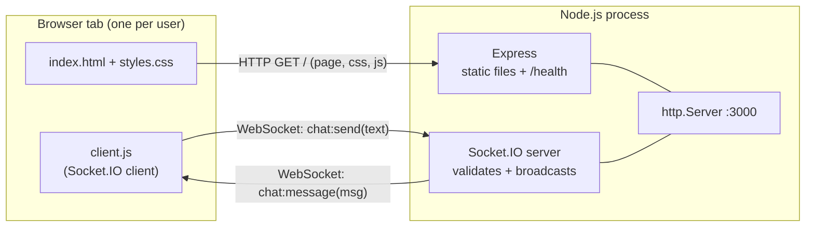

# realtime-chat

A real-time chat app with a retro terminal look. Built with **Node.js + TypeScript**, **Express** and **Socket.IO**, with a plain HTML/CSS/JS frontend (no framework).

Open it in two browser tabs, type in one, and the message appears in both instantly.

> **End goal:** live on the public internet, **free** ($0), **safe** for users and **secure** against common attacks.
> See [**Project status & plans**](#project-status--plans) and the full [**docs/**](docs/README.md) folder.

---

## Features (so far)

- Real-time messaging between all connected tabs (WebSockets via Socket.IO)
- Terminal-style UI with **4 switchable themes**: `phosphor` (green CRT), `amber`, `ice`, `paper` (light)
- Theme choice is remembered per browser (`localStorage`)
- Slash commands: `/help`, `/clear`, `/whoami`, `/theme [name]`
- Input history with ↑ / ↓
- Connection status indicator (online / reconnecting)
- Server-side input checks (string only, trimmed, 1–500 characters)
- XSS-safe rendering (user text is always inserted as plain text)
- `/health` endpoint for uptime checks
- Graceful shutdown on `SIGTERM` / `SIGINT`

---

## Architecture



**Message flow**

1. User types a message → `client.js` emits `chat:send` with the text.
2. The server checks it (must be a string, trimmed, 1–500 characters). Invalid input is dropped.
3. The server builds the message object, assigning its own `id` and `sentAt` timestamp.
4. The server broadcasts `chat:message` to **every** connected client, including the sender.
5. Each client renders the line using `textContent` (never `innerHTML`).

---

## Project structure

```
realtime-chat/
├── src/                    # Server code (TypeScript)
│   ├── index.ts            # Entry point: starts the server on PORT, handles shutdown + port errors
│   ├── app.ts              # buildServer(): creates Express + Socket.IO, wires events (does NOT listen → testable)
│   └── types.ts            # Shared event contracts (ChatMessage, client↔server event types)
├── public/                 # Frontend, served as static files by Express
│   ├── index.html          # Page layout: top bar, sidebar (rooms / online / theme), log, prompt
│   ├── styles.css          # Design tokens + 4 themes + layout (CSS variables, no framework)
│   └── client.js           # Socket.IO client, rendering, slash commands, theme switching, input history
├── tests/                  # Unit + integration tests (coming in a later phase)
├── docs/                   # Specs, design (HLD/LLD/ADRs), security, testing, ops, process → docs/README.md
├── .github/                # PR + issue templates (CI workflow coming in M2)
├── package.json            # Dependencies + npm scripts
├── package-lock.json       # Exact installed versions (commit this!)
├── tsconfig.json           # TypeScript compiler settings (strict, ES modules / NodeNext)
├── .gitignore              # Keeps node_modules, dist, *.db, .env out of git
└── README.md
```

---

## Message format and timestamps

Every chat message sent by the server looks like this:

```ts
interface ChatMessage {
  id: string;     // random UUID (crypto.randomUUID), unique per message
  from: string;   // sender id (first 5 chars of socket id until usernames exist)
  text: string;   // trimmed message, 1–500 characters
  sentAt: number; // timestamp: milliseconds since 1970-01-01 UTC (Unix epoch)
}
```

**About `sentAt`:**

- It is set by the **server** (`Date.now()`), never by the client. Client clocks can be wrong or faked, and one shared clock keeps message order consistent for everyone.
- It is stored as a **number in UTC** (epoch milliseconds). That's time-zone neutral and easy to sort and compare.
- Each browser converts it to **local time** for display, in 24-hour `HH:MM:SS` format, e.g. `[14:02:11]`. Two users in different time zones each see their own local time for the same message.

### Socket events

| Direction        | Event          | Payload        |
|------------------|----------------|----------------|
| client → server  | `chat:send`    | `text: string` |
| server → client  | `chat:message` | `ChatMessage`  |

---

## Dependencies

Exact versions are in `package.json` / `package-lock.json`. To list what's installed:

```bash
npm ls --depth=0
```

### Runtime dependencies (`dependencies`)

| Package          | What it does here                                                        |
|------------------|--------------------------------------------------------------------------|
| `express`        | HTTP server: serves `public/` and the `/health` endpoint                 |
| `socket.io`      | Real-time two-way events over WebSockets (with reconnection + fallbacks) |
| `zod`            | Schema validation for incoming events *(used from Phase 3)*              |
| `better-sqlite3` | Fast, synchronous SQLite driver for message history *(used later)*       |

### Development dependencies (`devDependencies`)

| Package                 | What it does here                                          |
|-------------------------|------------------------------------------------------------|
| `typescript`            | Type checking + compiling `src/` → `dist/`                 |
| `tsx`                   | Runs TypeScript directly, with auto-restart on file save   |
| `vitest`                | Test runner for unit + integration tests                   |
| `@types/node`           | Type definitions for Node.js built-ins                     |
| `@types/express`        | Type definitions for Express                               |
| `@types/better-sqlite3` | Type definitions for better-sqlite3                        |

---

## Running locally

### Requirements

- **Node.js 20 or newer** (`node -v`)
- **npm** (comes with Node)
- **git**

### Option A: GitHub Codespaces (no install needed)

1. On GitHub, open the repo → **Code** → **Codespaces** → **Create codespace on main**.
2. In the terminal:
   ```bash
   npm install
   npm run dev
   ```
3. When the popup for port 3000 appears, click **Open in Browser** (or use the **Ports** tab → globe icon).
4. Open the same URL in a second tab and chat between them.

### Option B: Your own computer

```bash
git clone https://github.com/futuresfsake/realtime-chat.git
cd realtime-chat
npm install
npm run dev
```

Open **http://localhost:3000** in two browser tabs.

> **Note:** `better-sqlite3` is a native module. On most systems, `npm install` downloads a prebuilt binary. If it fails on Windows, install the "Desktop development with C++" workload from Visual Studio Build Tools and run `npm install` again.

### Production-style run

```bash
npm run build     # compile TypeScript to dist/
npm start         # run the compiled JavaScript with plain Node
```

### Environment variables

| Variable | Default | Purpose                  |
|----------|---------|--------------------------|
| `PORT`   | `3000`  | Port the server listens on |

```bash
PORT=3001 npm run dev
```

### npm scripts

| Command              | What it does                                    |
|----------------------|-------------------------------------------------|
| `npm run dev`        | Start in development mode (auto-restart on save) |
| `npm run build`      | Compile TypeScript into `dist/`                 |
| `npm start`          | Run the compiled app from `dist/`               |
| `npm run typecheck`  | Type-check without emitting files               |
| `npm test`           | Run tests once                                  |
| `npm run test:watch` | Run tests in watch mode                         |

### Health check

```bash
curl http://localhost:3000/health
# {"status":"ok"}
```

---

## Troubleshooting

| Problem                                   | Fix                                                                                         |
|-------------------------------------------|---------------------------------------------------------------------------------------------|
| `EADDRINUSE: address already in use :::3000` | Another server is still running. Stop it with Ctrl+C in its terminal, or `kill $(lsof -t -i :3000)`, or use `PORT=3001 npm run dev` |
| `ERR_MODULE_NOT_FOUND` for a local file   | Relative imports in `src/` must end in `.js` (e.g. `./app.js`); this is required by NodeNext |
| Page loads but status stays `CONNECTING`  | Check the server terminal for errors, then reload the tab                                   |
| Theme doesn't persist                     | The browser is blocking `localStorage` (e.g. strict private mode). The theme still works for the current visit |

---

## Timeline

| Date (UTC+8) | Milestone                                                                 |
|--------------|---------------------------------------------------------------------------|
| 2026-10-08   | **Phase 1:** project scaffold (Node + TypeScript, ES modules, scripts)    |
| 2026-10-08   | **Phase 2:** Express + Socket.IO server, two tabs exchange messages       |
| 2026-10-08   | **UI:** terminal-style frontend, slash commands, 4 switchable themes      |
| 2026-10-08   | **Docs:** specs, HLD/LLD, ADRs, threat model, testing strategy, workflows |

Exact commit timestamps: `git log --date=iso --pretty="%h %ad %s"`

## Project status & plans

**Where we are:** M1 (Live MVP). The app works and is being deployed to Render.
**What's next:** **M2 Hardening + CI.** The app is public, so we secure it *before* adding features.

| Milestone | Goal | Status |
|---|---|---|
| M0 Foundations | Scaffold, TypeScript, scripts | ✅ |
| M1 Live MVP | Real-time chat, terminal UI + themes, deployed on Render | 🚧 |
| **M2 Hardening + CI** | zod validation, rate limiting, security headers, Origin check, CI pipeline | 🔜 **next** |
| M3 Identity & Rooms | Usernames, rooms, online list, typing indicator, socket integration test | 🔜 |
| M4 Persistence | Message history in SQLite (last 50 per room) | 🔜 |
| M5 Quality & Observability | Structured logs, coverage, `npm audit`, Dependabot | 🔜 |
| M6 Public Launch | Security checklist 100%, uptime monitor, share the link | 🔜 |

Details and exit criteria: [docs/01-product/milestones.md](docs/01-product/milestones.md)

### Future optimizations (after v1)
- Virtualized message list (render only visible rows) for very long sessions
- Redis adapter + sticky sessions to run multiple server instances
- Durable database (hosted SQLite / Postgres) instead of the free tier's ephemeral disk
- "Load older messages" pagination
- Accounts (OAuth) to prevent username impersonation

---

## Documentation

| Topic | Doc |
|---|---|
| Vision & goals | [docs/00-overview/vision.md](docs/00-overview/vision.md) |
| Features | [docs/01-product/features.md](docs/01-product/features.md) |
| User stories | [docs/01-product/user-stories.md](docs/01-product/user-stories.md) |
| Milestones / roadmap | [docs/01-product/milestones.md](docs/01-product/milestones.md) |
| Specifications (FR/NFR) | [docs/02-requirements/specs.md](docs/02-requirements/specs.md) |
| High-level design | [docs/03-design/high-level-design.md](docs/03-design/high-level-design.md) |
| Low-level design | [docs/03-design/low-level-design.md](docs/03-design/low-level-design.md) |
| Architecture decisions | [docs/03-design/adr/](docs/03-design/adr/README.md) |
| Threat model | [docs/04-security/threat-model.md](docs/04-security/threat-model.md) |
| Security checklist | [docs/04-security/security-checklist.md](docs/04-security/security-checklist.md) |
| Testing strategy | [docs/05-quality/testing-strategy.md](docs/05-quality/testing-strategy.md) |
| Deployment | [docs/06-operations/deployment.md](docs/06-operations/deployment.md) |
| Runbook | [docs/06-operations/runbook.md](docs/06-operations/runbook.md) |
| Workflows (git, PRs, DoD) | [docs/07-process/workflows.md](docs/07-process/workflows.md) |
| Templates | [docs/07-process/templates/](docs/07-process/templates/README.md) |
