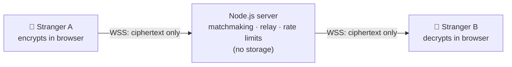

# realtime-chat

**Anonymous, end-to-end encrypted, one-to-one chat that connects strangers around the world by shared interests.**
No accounts. No stored messages. Free to use, safe by design.

> **Mission:** connect people across the world through safe, private, anonymous conversations, on a platform that stays **free**, runs **reliably** and **protects its users**.
> 📚 Full documentation: [**docs/**](docs/README.md) · 🗺️ Plan: [**milestones**](docs/01-product/milestones.md)

> ⚠️ **Status: M1 complete (walking skeleton).** Today the app is a single shared chat room. The anonymous 1:1, encrypted, interest-matched product is being built milestone by milestone, starting with **M2: Hardening + CI/CD + first deploy**.

---

## What it will be (v1)

1. Confirm you're **18+** and accept the rules
2. Optionally pick up to 5 **interests** and choose **my country** or **worldwide**
3. Get a **random name** (e.g. `quiet-otter-42`) and get matched with **one stranger** who shares an interest, or a random stranger after 10 s
4. Chat with **end-to-end encryption**: the server only relays ciphertext it can't read
5. `/next` to meet someone new, `/report` to report abuse. When a chat ends, its messages are **gone forever**

**Never:** accounts, passwords, user-chosen names, group chats, file/image uploads, stored history.

## What works today (M1)

- Real-time messaging between all connected tabs (Socket.IO)
- Terminal-style UI with 4 themes (`phosphor`, `amber`, `ice`, `paper`), saved per browser
- Slash commands `/help` `/clear` `/whoami` `/theme`, and ↑/↓ input history
- Connection status + auto-reconnect; `/health` endpoint; graceful shutdown
- Basic server-side input checks; XSS-safe rendering (`textContent`)

---

## Architecture

**Target (v1):** the server is a **blind relay**. It matches strangers and forwards encrypted envelopes, and it stores nothing.



Step-by-step request flows: [docs/03-design/high-level-design.md](docs/03-design/high-level-design.md) · Encryption protocol: [docs/04-security/e2ee.md](docs/04-security/e2ee.md)

---

## Project structure (today)

```
realtime-chat/
├── src/                    # Server (TypeScript)
│   ├── index.ts            # Entry: listen on PORT, port-in-use message, graceful shutdown
│   ├── app.ts              # buildServer(): Express + Socket.IO (doesn't listen → testable)
│   └── types.ts            # Event contracts
├── public/                 # Frontend (static files)
│   ├── index.html · styles.css · client.js
├── tests/                  # Unit tests (M2+), integration tests (M3+)
├── docs/                   # Specs, design, security, operations, process, guides → docs/README.md
├── .github/                # PR + issue templates (CI workflow arrives in M2)
├── package.json · package-lock.json · tsconfig.json · .gitignore
└── README.md
```
Target module layout: [docs/03-design/low-level-design.md](docs/03-design/low-level-design.md#1-module-layout-target-reviewed-for-the-11-e2ee-design)

---

## Dependencies

| Package | Purpose | Status |
|---|---|---|
| `express` | HTTP server, static files, `/health` | ✅ used |
| `socket.io` | Real-time events, reconnection, connection state recovery | ✅ used |
| `zod` | Runtime validation of every incoming event ([why](docs/03-design/validation-zod.md)) | M2 |
| `helmet` | Security headers + CSP | M2 (to install) |
| `better-sqlite3` | ~~Message history~~ | ⏸ **to be removed**: no message storage ([ADR-0005](docs/03-design/adr/0005-no-server-side-message-storage.md), D-05) |

**Dev:** `typescript`, `tsx`, `vitest`, `@types/node`, `@types/express`, `@types/better-sqlite3` (removed with D-05), `socket.io-client` (M3, tests).
Encryption uses the browser's built-in **WebCrypto**, with no crypto library. List installed versions with `npm ls --depth=0`.

---

## Run it locally

```bash
npm ci
npm run dev      # http://localhost:3000 (open 2+ tabs)
```
Full guide (Codespaces, your own computer, phone testing, common problems): [docs/08-guides/local-development.md](docs/08-guides/local-development.md)

| Command | What it does |
|---|---|
| `npm run dev` | Development server with auto-restart |
| `npm run build` / `npm start` | Compile to `dist/` / run like production |
| `npm run typecheck` | TypeScript checks |
| `npm test` / `npm run test:watch` | Tests once / on every save |

Environment variables: [docs/06-operations/deployment.md](docs/06-operations/deployment.md#environment-variables)

---

## Project status & plans

| Milestone | Goal | Effort | Status |
|---|---|---|---|
| M0 Foundations | Scaffold, TypeScript, scripts | — | ✅ |
| M1 Walking skeleton | Two tabs chat; terminal UI + themes | — | ✅ |
| **M2 Hardening + CI/CD + first deploy** | zod, rate limits, headers/CSP, Origin check, CI, Render CD | 3–4 d | 🔜 **next** |
| M3 1:1 anonymous sessions | Random names, pairs of two, `/next` `/leave`, status, typing, reactions | 4–5 d | 🔜 |
| M4 End-to-end encryption | ECDH + AES-GCM in the browser; `/verify` safety code | 4–5 d | 🔜 |
| M5 Matchmaking | Interests, my country / worldwide, fallback | 3 d | 🔜 |
| M6 Trust & safety | 18+ gate, rules, `/report`, temp bans | 3–4 d | 🔜 |
| M7 Quality & automation | Coverage, logs, monitoring, Dependabot, CodeQL, load test | 2–3 d | 🔜 |
| M8 Public launch | Security checklist 100%, share the link 🌍 | 1–2 d | 🔜 |

Details, stories and exit criteria: [docs/01-product/milestones.md](docs/01-product/milestones.md) · Open decisions: [docs/00-overview/open-decisions.md](docs/00-overview/open-decisions.md)

### After v1
Multi-language UI · multi-instance scaling with Redis · more regions · installable PWA. See [scaling.md](docs/06-operations/scaling.md).

---

## Documentation

| Folder | What's inside |
|---|---|
| [00-overview](docs/00-overview/README.md) | Vision, goals, non-goals, open decisions |
| [01-product](docs/01-product/README.md) | Milestones, user stories, features, slash commands |
| [02-requirements](docs/02-requirements/README.md) | Functional + non-functional requirements, limits |
| [03-design](docs/03-design/README.md) | HLD, LLD, matchmaking, zod validation, ADRs |
| [04-security](docs/04-security/README.md) | E2EE, privacy & sessions (incl. why no JWT), trust & safety, threat model, checklist |
| [05-quality](docs/05-quality/README.md) | Testing strategy |
| [06-operations](docs/06-operations/README.md) | Render, deployment, health checks, scaling, runbook |
| [07-process](docs/07-process/README.md) | Workflows, Definition of Done, CI/CD, automation, templates |
| [08-guides](docs/08-guides/README.md) | Local development |
| [GLOSSARY](docs/GLOSSARY.md) | Every term and acronym |

---

## Timeline

| Date (UTC+8) | Milestone |
|---|---|
| 2026-10-08 | **M0:** project scaffold |
| 2026-10-08 | **M1:** Express + Socket.IO chat, terminal UI, 4 themes |
| 2026-10-08 | **Docs v1:** specs, design, security, process |
| 2026-10-08 | **Docs v2:** product redefined: anonymous 1:1, E2EE, interest/country matching, global reach |

Exact commit times: `git log --date=iso --pretty="%h %ad %s"`
