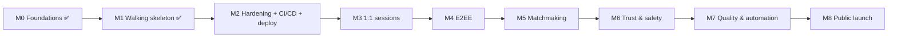

# Milestones

We work in **milestones**, not sprints. Each milestone is a **foundation layer**: it delivers a set of **user stories**, which are implemented as **features**, and ends with a working, deployed, demoable product.

```
Milestone ──contains──▶ User stories (user value) ──implemented by──▶ Features (what we build) ──verified by──▶ Tests
```

## Is this realistic? Honest sizing
The original plan was "5 hours". The product has grown into anonymous matching + **end-to-end encryption** + trust & safety + global reach. A realistic estimate for one intern learning along the way:

| | Effort (focused days) |
|---|---|
| M2 → M8 total | **~20–26 days** (about 4–6 weeks part-time) |

Estimates assume ~5 focused hours/day and include learning, tests and docs. **E2EE (M4) is the riskiest**: budget extra time.

## Overview

| # | Milestone | Goal | Stories | Effort | Status |
|---|---|---|---|---|---|
| M0 | Foundations | Project skeleton | — | done | ✅ |
| M1 | Walking skeleton | Two tabs chat; terminal UI | US-26, US-27 | done | ✅ |
| **M2** | **Hardening + CI/CD + first deploy** | Safe to be on the internet, deployed automatically | US-21–24 | 3–4 d | 🔜 **next** |
| M3 | 1:1 anonymous sessions | Random names, pairs of two, skip/leave, status, reactions | US-01–11 | 4–5 d | 🔜 |
| M4 | End-to-end encryption | Server can't read anything | US-12, US-13 | 4–5 d | 🔜 |
| M5 | Matchmaking | Interests + country/worldwide + fallback | US-14–16 | 3 d | 🔜 |
| M6 | Trust & safety | 18+ gate, report, no-rematch, temp bans | US-17–20 | 3–4 d | 🔜 |
| M7 | Quality, observability, automation | Confidence + monitoring | US-25 | 2–3 d | 🔜 |
| M8 | Public launch | Everything checked; share it | — | 1–2 d | 🔜 |



**Why this order?**
1. **Security and pipeline first (M2):** every later milestone is tested and deployed automatically, and the live URL is never unprotected.
2. **Sessions before encryption (M3 → M4):** E2EE needs a stable "pair of two" to exchange keys in.
3. **Encryption before matching (M4 → M5):** the message format (encrypted envelope) settles early, so later features don't need to be redone.
4. **Safety before launch (M6 → M8):** non-negotiable for an anonymous stranger chat.

---

## Milestone Definition of Done (applies to every milestone)
1. ✅ All the milestone's stories meet the **story DoD** ([user-stories.md](user-stories.md#definition-of-done-for-every-story))
2. ✅ The milestone's exit criteria below are all checked
3. ✅ CI green on `main`; deployed to Render; release smoke test passed on the live URL
4. ✅ Threat model + security checklist updated for anything new
5. ✅ Docs, feature statuses and README status table updated
6. ✅ **Demo script** performed end-to-end on the live URL (phone + laptop)
7. ✅ Retro note added at the bottom of this file (what went well, what to change)

---

## M0 Foundations ✅
Scaffold, TypeScript strict, ES modules, scripts, `.gitignore`.

## M1 Walking skeleton ✅
Two browser tabs exchange messages; terminal UI with themes, slash commands and input history.
**Note:** deployment moved to M2, so the app is never online without protection.

## M2 Hardening + CI/CD + first deploy 🔜 ← NEXT
**Goal:** the current app is safe on the public internet, and every merge to `main` is tested and deployed automatically.

| Story | Features |
|---|---|
| US-21 Bad input rejected | F-07 zod schemas, `config.ts` |
| US-22 Spam limited | F-08 token bucket, per-IP cap |
| US-23 Only our site connects | F-09 helmet + CSP, Origin allowlist, 4 KB payload limit |
| US-24 Use it from anywhere | F-10 CI, F-11 Render CD ("After CI checks pass") |

**Exit criteria**
- [ ] Unit tests: schemas, rate limiter (with a fake clock)
- [ ] GitHub Actions CI: `npm ci → typecheck → test → build → audit` on every PR
- [ ] Branch protection: `main` requires a PR and green CI
- [ ] Render service live, Auto-Deploy = **After CI checks pass**, health check `/health`
- [ ] `ALLOWED_ORIGINS` configured; a socket from another origin is refused
- [ ] Security headers grade ≥ A
**Demo:** spam 20 messages → "slow down" after 5; send a 10 KB payload → rejected; phone ↔ laptop chat on the live URL.
**Risks:** CSP blocks the inline theme script → allow it by hash.

## M3 1:1 anonymous sessions 🔜
**Goal:** strangers are paired two at a time with random names; global broadcast is gone.

| Story | Features |
|---|---|
| US-01 Random name | F-12 |
| US-02 / US-03 Chat with one stranger, exactly two | F-13 session manager |
| US-04 / US-05 Skip / leave | F-16 `/start /next /leave` |
| US-06 / US-07 Partner status + typing | F-14, F-18 |
| US-08 Reactions | F-19 |
| US-09 Session-only history | F-17 |
| US-10 Online counter | F-15 |
| US-11 Survive drops | F-05 + Socket.IO connection state recovery (30 s) |

**Exit criteria**
- [ ] Session state machine implemented (READY → SEARCHING → CHATTING → ENDED) with unit tests
- [ ] **Integration test:** 3 clients → A and B paired; C waits; A's message reaches only B
- [ ] A forged session id can't join or read another session (test)
- [ ] Old global broadcast removed
**Demo:** three tabs: two get paired, the third waits; `/next` re-pairs; refresh wipes history.
**Risks:** race conditions when two people skip at once → all pairing logic runs in one synchronous function.

## M4 End-to-end encryption 🔜
**Goal:** the server only relays ciphertext; operators can't read any message.

| Story | Features |
|---|---|
| US-12 Messages encrypted | F-20 ECDH P-256 key exchange, HKDF, AES-GCM-256, per-direction keys, sequence numbers |
| US-13 Verify | F-21 safety code, `/verify` |

**Exit criteria**
- [ ] Crypto module unit-tested: encrypt/decrypt round trip, tamper → reject, replay → reject, IVs never repeat
- [ ] Integration test: server-side spy confirms only ciphertext crosses the server
- [ ] No plaintext fallback anywhere (test: WebCrypto unavailable → session refused)
- [ ] [e2ee.md](../04-security/e2ee.md) reviewed against the implementation; threat rows T-07–T-11 ✅
**Demo:** dev tools → Network → WS frames show only ciphertext; both `/verify` codes match.
**Risks:** crypto mistakes are silent → only standard WebCrypto primitives, no custom crypto, peer review of the design doc.

## M5 Matchmaking 🔜
**Goal:** people with shared interests meet; country preference is respected.

| Story | Features |
|---|---|
| US-14 Interests | F-22 predefined list, max 5 |
| US-15 Country/world | F-23 server-side country lookup (DB-IP Lite) |
| US-16 Fallback | F-24 10 s timer |

**Exit criteria**
- [ ] Matchmaker unit tests: interest overlap, country compatibility matrix, fallback timing (fake timers), fairness (longest waiting first), no self-match
- [ ] Country lookup never stores the IP; the DB-IP attribution link is shown in the footer
**Demo:** two tabs with `gaming` match each other while a `music` tab waits, then falls back after 10 s.
**Risks:** few users → long waits. The fallback and the online counter set expectations.

## M6 Trust & safety 🔜
| Story | Features |
|---|---|
| US-17 Age + rules gate | F-25 |
| US-18 Report | F-26 |
| US-19 No rematch | F-27 |
| US-20 Temp bans | F-28 |

**Exit criteria**
- [ ] Rules page + privacy notice written in plain language
- [ ] Ban logic unit-tested (3 distinct reporters / 1 h → 24 h block; salt rotates daily)
- [ ] [trust-and-safety.md](../04-security/trust-and-safety.md) controls all ✅ or accepted
**Demo:** three tabs report one → it can't match for 24 h (shortened in a test config).

## M7 Quality, observability, automation 🔜
**Exit criteria**
- [ ] Coverage ≥ 80% on `security/`, `crypto/`, `matchmaking/`, `sessions/`
- [ ] JSON logs with no content and no raw IPs; counters for sessions, matches, rejections, reports
- [ ] Uptime monitor + post-deploy smoke test in CI/CD
- [ ] Dependabot, CodeQL, ESLint/Prettier, link checker in CI ([automation.md](../07-process/automation.md))
- [ ] Small load test (e.g. 200 simulated users) documented in [scaling.md](../06-operations/scaling.md)

## M8 Public launch 🔜
**Release DoD**
- [ ] [Security checklist](../04-security/security-checklist.md) 100% passed
- [ ] All open decisions in [open-decisions.md](../00-overview/open-decisions.md) resolved
- [ ] Privacy notice + rules live; DB-IP attribution shown
- [ ] README, docs and CHANGELOG up to date; `v1.0.0` git tag
- [ ] Rollback tested once
- [ ] Share the link 🌍

## After v1 (growth backlog)
Multi-language UI (i18n) for global reach · multi-instance scaling with Redis (see [scaling.md](../06-operations/scaling.md)) · additional regions · PWA (installable app) · periodic re-keying.

---

## Retro notes
*(Add a short note after each milestone: what went well, what didn't, what we change.)*
