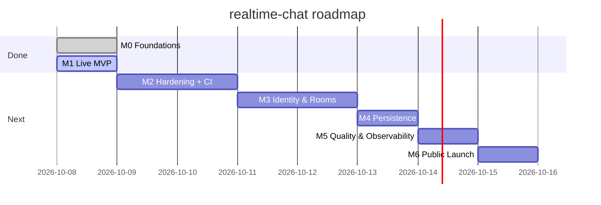

# Milestones & Roadmap

Each milestone has **exit criteria**. It's done only when all of them are true.

*(Dates are targets, not promises.)*

---

## M0 Foundations ✅
Scaffold, TypeScript strict, ES modules, scripts, `.gitignore`, README.
- [x] `npm run typecheck` passes
- [x] Project runs in Codespaces

## M1 Live MVP 🚧
Two clients can chat; terminal UI with themes; deployed publicly.
- [x] Two tabs exchange messages
- [x] Themes + slash commands
- [ ] Live on Render over HTTPS
- [ ] Phone (mobile data) ↔ laptop chat works

## M2 Hardening + CI 🔜 ← **NEXT**
*The app is already public, so safety comes before new features.*
- [ ] zod schemas validate every incoming event (US-07)
- [ ] Token-bucket rate limit per socket (US-08)
- [ ] `maxHttpBufferSize` = 1 KB, Origin check, security headers (helmet)
- [ ] Config read and validated from env (`config.ts`)
- [ ] GitHub Actions: typecheck + test + build on every PR
- [ ] Unit tests for schemas and rate limiter
- [ ] Threat model items T-01, T-02, T-04, T-05 → ✅

## M3 Identity & Rooms 🔜
- [ ] Usernames (US-02), rooms (US-03), online list (US-04), typing (US-05)
- [ ] Sidebar ROOMS / ONLINE filled with live data
- [ ] Unit tests for the presence store
- [ ] **1 Socket.IO integration test** (two clients, same room)

## M4 Persistence 🔜
- [ ] SQLite message repository with prepared statements
- [ ] Last 50 messages per room on join (US-06)
- [ ] Decision recorded on Render's ephemeral disk (ADR-0002 follow-up)
- [ ] Repository tests using in-memory SQLite

## M5 Quality & Observability 🔜
- [ ] Structured JSON logs (no message content, no IPs in plain text)
- [ ] Basic metrics in logs: connections, messages/min, rejections
- [ ] Coverage report in CI
- [ ] Dependabot + `npm audit` in CI

## M6 Public Launch 🔜
- [ ] [Security checklist](../04-security/security-checklist.md) 100% passed
- [ ] Uptime monitor on `/health`
- [ ] README + docs up to date; Roadmap ticked
- [ ] Share the link 🎉

## Later / optimization backlog (after v1)
- Virtualized message list (render only visible rows)
- Redis adapter + sticky sessions for multiple instances
- Persistent DB (Turso / Postgres) instead of an ephemeral SQLite file
- Message compression, pagination ("load older messages")
- Accounts (OAuth) to stop name impersonation
