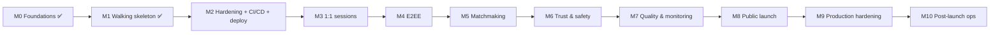

# Milestones

We work in **milestones**, not sprints. Each milestone is a **foundation layer**: it delivers a set of **user stories**, which are implemented as **features**, and ends with a working, deployed, demoable product.

```
Milestone ──contains──▶ User stories (user value) ──implemented by──▶ Features (what we build) ──verified by──▶ Tests
```

## Is this realistic? Honest sizing
The original plan was "5 hours". The product has grown into anonymous matching + **end-to-end encryption** + trust & safety + global reach. A realistic estimate for one intern learning along the way:

| | Effort (focused days) |
|---|---|
| M2 → M8 total | **~20–26 days** (about 4–6 weeks part-time) |

Estimates assume ~5 focused hours/day and include learning, tests and docs. **E2EE (M4) is the riskiest**: budget extra time.

## Overview

| # | Milestone | Goal | Stories | Effort | Status |
|---|---|---|---|---|---|
| M0 | Foundations | Project skeleton | — | done | ✅ |
| M1 | Walking skeleton | Two tabs chat; terminal UI | US-26, US-27 | done | ✅ |
| **M2** | **Hardening + CI/CD + first deploy** | Safe to be on the internet, deployed automatically | US-21–24, US-32–35 | 4–5 d | 🔜 **next** |
| M3 | 1:1 anonymous sessions | Random names, pairs of two, skip/leave, status, reactions | US-01–11, US-36 | 4–5 d | 🔜 |
| M4 | End-to-end encryption | Server can't read anything | US-12, US-13, US-37 | 4–5 d | 🔜 |
| M5 | Matchmaking | Interests + country/worldwide + fallback | US-14–16 | 3 d | 🔜 |
| M6 | Trust & safety | 18+ gate, report, no-rematch, temp bans, content filters, compliance drafts | US-17–20, US-28–29, US-38–39 | 4–5 d | 🔜 |
| M7 | Quality, observability, monitoring & moderation | Coverage, logs, SLOs, dashboards, a11y, moderator tools | US-25, US-30–31, US-40–44 | 3–4 d | 🔜 |
| M8 | Public launch | Legal sign-off, compliance 100%, go live | US-45–46 | 2–3 d | 🔜 |
| **M9** | **Production hardening** | Pen test, DR drill, performance baseline, chaos testing | US-47–49 | 3–4 d | 🔜 |
| **M10** | **Post-launch operations** | Incident response drill, on-call, operational maturity, retrospective | US-50 | 2–3 d | 🔜 |


```mermaid
flowchart LR
    M0[M0 Foundations ✅] --> M1[M1 Walking skeleton ✅] --> M2[M2 Hardening + CI/CD + deploy]
    M2 --> M3[M3 1:1 sessions] --> M4[M4 E2EE] --> M5[M5 Matchmaking] --> M6[M6 Trust & safety]
    M6 --> M7[M7 Quality & monitoring] --> M8[M8 Public launch]
    M8 --> M9[M9 Production hardening] --> M10[M10 Post-launch ops]
```

**Why this order?**
1. **Security and pipeline first (M2):** every later milestone is tested and deployed automatically, and the live URL is never unprotected.
2. **Sessions before encryption (M3 → M4):** E2EE needs a stable "pair of two" to exchange keys in.
3. **Encryption before matching (M4 → M5):** the message format (encrypted envelope) settles early, so later features don't need to be redone.
4. **Safety before launch (M6 → M8):** non-negotiable for an anonymous stranger chat.

---

## Production Pipeline

Every milestone and story flows through the IT Manager production pipeline:

| Pipeline | Scope | Documentation |
|---|---|---|
| **M-Pipeline** | Milestone lifecycle: Plan → M-DoR → Stories → M-DoD → Release | [milestone-pipeline.md](../10-pipeline/milestone-pipeline.md) |
| **S-Pipeline** | Story lifecycle: DoR → Build → DoD → Merge | [story-lifecycle.md](../10-pipeline/story-lifecycle.md) |
| **H-Pipeline** | Hotfix fast-track: Triage → H-DoR → Fix → H-DoD → Deploy | [hotfix-pipeline.md](../10-pipeline/hotfix-pipeline.md) |

Stories are classified as **GATED** (CRITICAL/HIGH: manual review required) or **CONTINUOUS** (MEDIUM/LOW: automated gates only). See [story-classification.md](../10-pipeline/story-classification.md) for the full classification of all 50 stories.

**Pipeline rules:**
- Per-file commits, per-file pushes — always
- No story starts without DoR pass
- No story merges without DoD pass
- DoD audits 7 angles: code, security, testing, docs, UX, compliance, evidence

**DICT security gates:** each milestone also has privacy/security release gates, see [11-dict-review/milestones.md](../11-dict-review/milestones.md).

## Milestone Definition of Done (applies to every milestone)
1. ✅ All the milestone's stories meet the **story DoD** ([user-stories.md](user-stories.md#definition-of-done-for-every-story))
2. ✅ The milestone's exit criteria below are all checked
3. ✅ CI green on `main`; deployed to Render; release smoke test passed on the live URL
4. ✅ Threat model + security checklist updated for anything new
5. ✅ Docs, feature statuses and README status table updated
6. ✅ **Demo script** performed end-to-end on the live URL (phone + laptop)
7. ✅ Retro note added at the bottom of this file (what went well, what to change)
8. ✅ **M-DoD report** generated: `testresults/dod/MN-dod.json`
9. ✅ **All story DoD reports** exist in `testresults/dod/`
10. ✅ **Milestone tagged** in git: `git tag -a MN-complete`

---

## M0 Foundations ✅
Scaffold, TypeScript strict, ES modules, scripts, `.gitignore`.

## M1 Walking skeleton ✅
Two browser tabs exchange messages; terminal UI with themes, slash commands and input history.
**Note:** deployment moved to M2, so the app is never online without protection.

## M2 Hardening + CI/CD + first deploy 🔜 ← NEXT
**Goal:** the current app is safe on the public internet, and every merge to `main` is tested and deployed automatically.

| Story | Features |
|---|---|
| US-21 Bad input rejected | F-07 zod schemas, `config.ts` |
| US-22 Spam limited | F-08 token bucket, per-IP cap |
| US-23 Only our site connects | F-09 helmet + CSP, Origin allowlist, 4 KB payload limit |
| US-24 Use it from anywhere | F-10 CI, F-11 Render CD ("After CI checks pass") |
| **US-32 Connection authentication** | F-36 connection token (server-signed nonce, 30s TTL) |
| **US-33 Structured logging** | F-37 JSON logs, log levels, correlation IDs, no PII |
| **US-34 Deep health check** | F-38 memory, connections, Socket.IO status in `/health` |
| **US-35 Protocol versioning** | F-39 `rc/v1` in handshake auth, version mismatch rejection |

**Exit criteria**
- [ ] Unit tests: schemas, rate limiter (with a fake clock)
- [ ] GitHub Actions CI: `npm ci → typecheck → test → build → audit` on every PR
- [ ] Branch protection: `main` requires a PR and green CI
- [ ] Render service live, Auto-Deploy = **After CI checks pass**, health check `/health`
- [ ] `ALLOWED_ORIGINS` configured; a socket from another origin is refused
- [ ] Security headers grade ≥ A
- [ ] **IT-REVIEW:** Connection token issued via `/connect-token` and validated on WS handshake
- [ ] **IT-REVIEW:** Structured JSON logging with correlation IDs; no raw IPs in any log (verified by CI grep)
- [ ] **IT-REVIEW:** `/health` returns memory usage, connection count, and Socket.IO status
- [ ] **IT-REVIEW:** Protocol version `rc/v1` validated on every connection; mismatch → refused
- [ ] **IT-REVIEW:** `better-sqlite3` removed from dependencies
- [ ] **IT-REVIEW:** `.node-version` file created (pin Node 22)
- [ ] **IT-REVIEW:** `npm run build` script working (tsc compilation)
- [ ] **IT-REVIEW:** `.env.example` created with all required env vars
- [ ] **IT-REVIEW:** Memory ceiling configured (`--max-old-space-size=400`)
- [ ] **IT-REVIEW:** CSP includes `report-uri` or `report-to` directive
- [ ] **IT-REVIEW:** CODEOWNERS file for security-critical paths
- [ ] **IT-REVIEW:** `SECURITY.md` with vulnerability disclosure policy
- [ ] **IT-REVIEW:** Connection-rate limiting on WS handshake (5 new connections/IP/10s)
- [ ] **IT-REVIEW:** Cold start loading screen in client UI
**Demo:** spam 20 messages → "slow down" after 5; send a 10 KB payload → rejected; phone ↔ laptop chat on the live URL; connection without token → refused; check `/health` returns system metrics.
**Risks:** CSP blocks the inline theme script → allow it by hash. Connection token adds latency → keep TTL short (30s).

## M3 1:1 anonymous sessions 🔜
**Goal:** strangers are paired two at a time with random names; global broadcast is gone.

| Story | Features |
|---|---|
| US-01 Random name | F-12 |
| US-02 / US-03 Chat with one stranger, exactly two | F-13 session manager |
| US-04 / US-05 Skip / leave | F-16 `/start /next /leave` |
| US-06 / US-07 Partner status + typing | F-14, F-18 |
| US-08 Reactions | F-19 |
| US-09 Session-only history | F-17 |
| US-10 Online counter | F-15 |
| US-11 Survive drops | F-05 + Socket.IO connection state recovery (30 s) |

**Exit criteria**
- [ ] Session state machine implemented (READY → SEARCHING → CHATTING → ENDED) with unit tests
- [ ] **Integration test:** 3 clients → A and B paired; C waits; A's message reaches only B
- [ ] A forged session id can't join or read another session (test)
- [ ] Old global broadcast removed
**Demo:** three tabs: two get paired, the third waits; `/next` re-pairs; refresh wipes history.
**Risks:** race conditions when two people skip at once → all pairing logic runs in one synchronous function.

## M4 End-to-end encryption 🔜
**Goal:** the server only relays ciphertext; operators can't read any message.

| Story | Features |
|---|---|
| US-12 Messages encrypted | F-20 ECDH P-256 key exchange, HKDF, AES-GCM-256, per-direction keys, sequence numbers |
| US-13 Verify | F-21 safety code, `/verify` |

**Exit criteria**
- [ ] Crypto module unit-tested: encrypt/decrypt round trip, tamper → reject, replay → reject, IVs never repeat
- [ ] Integration test: server-side spy confirms only ciphertext crosses the server
- [ ] No plaintext fallback anywhere (test: WebCrypto unavailable → session refused)
- [ ] [e2ee.md](../04-security/e2ee.md) reviewed against the implementation; threat rows T-07–T-11 ✅
**Demo:** dev tools → Network → WS frames show only ciphertext; both `/verify` codes match.
**Risks:** crypto mistakes are silent → only standard WebCrypto primitives, no custom crypto, peer review of the design doc.

## M5 Matchmaking 🔜
**Goal:** people with shared interests meet; country preference is respected.

| Story | Features |
|---|---|
| US-14 Interests | F-22 predefined list, max 5 |
| US-15 Country/world | F-23 server-side country lookup (DB-IP Lite) |
| US-16 Fallback | F-24 10 s timer |

**Exit criteria**
- [ ] Matchmaker unit tests: interest overlap, country compatibility matrix, fallback timing (fake timers), fairness (longest waiting first), no self-match
- [ ] Country lookup never stores the IP; the DB-IP attribution link is shown in the footer
**Demo:** two tabs with `gaming` match each other while a `music` tab waits, then falls back after 10 s.
**Risks:** few users → long waits. The fallback and the online counter set expectations.

## M6 Trust & safety 🔜
| Story | Features |
|---|---|
| US-17 Age + rules gate | F-25 |
| US-18 Report | F-26 |
| US-19 No rematch | F-27 |
| US-20 Temp bans | F-28 |
| US-28 Content filters | F-32 |
| US-29 Expanded report categories | F-33 |
| **US-38 Privacy notice and terms of service** | F-40 draft privacy notice, ToS, AUP |
| **US-39 Bot prevention** | F-41 proof-of-work challenge on `/start` |

**Exit criteria**
- [ ] Rules page + privacy notice written in plain language, referencing RA 11313 and RA 11930 obligations
- [ ] Ban logic unit-tested (3 distinct reporters / 1 h → 24 h block; salt rotates daily)
- [ ] Content filters active for banned words, spam patterns, and personal info warnings
- [ ] Report categories cover `harassment`, `sexual`, `spam`, `hate`, `minor`, `threats`, `other`
- [ ] `minor` and `threats` reports flagged for priority escalation
- [ ] [trust-and-safety.md](../04-security/trust-and-safety.md) controls all ✅ or accepted
- [ ] **IT-REVIEW:** Server-side consent enforcement (18+ + rulesVersion validation)
- [ ] **IT-REVIEW:** Draft privacy notice covering RA 10173 requirements
- [ ] **IT-REVIEW:** Draft terms of service and acceptable use policy
- [ ] **IT-REVIEW:** Proof-of-work challenge before first session (SHA-256, ~50ms for browsers)
- [ ] **IT-REVIEW:** Data flow diagram formalized in docs/04-security/
- [ ] **IT-REVIEW:** Philippine lawyer review engaged (budget 2-4 weeks)
- [ ] **IT-REVIEW:** Content filter bypass documented as accepted risk (client-side, E2EE limitation)
**Demo:** three tabs report one → it can't match for 24 h (shortened in a test config); send a banned word → filter activates; bot script fails proof-of-work challenge under load.
**Risks:** Lawyer review timeline may delay M8. Content filter bypass is an accepted architectural trade-off (E2EE).

## M7 Quality, observability, monitoring & moderation 🔜

| Story | Features |
|---|---|
| US-25 Operator monitoring | F-29, F-30 |
| US-30 Automated monitoring | F-34 |
| US-31 Human moderator tools | F-35 |
| **US-40 SLIs and SLOs** | F-42 service level indicators and objectives |
| **US-41 Metrics collection** | F-43 in-process counters, metrics snapshot every 60s |
| **US-42 Alerting** | F-44 UptimeRobot + metric threshold alerts |
| **US-43 Accessibility compliance** | F-45 WCAG AA audit, keyboard nav, screen reader |
| **US-44 Incident response procedures** | F-46 IRP, breach notification, child safety escalation |

**Exit criteria**
- [ ] Coverage ≥ 80% on `security/`, `crypto/`, `matchmaking/`, `sessions/`
- [ ] JSON logs with no content and no raw IPs; counters for sessions, matches, rejections, reports
- [ ] Automated behavioral monitoring operational: report velocity, session churn, connection pattern tracking
- [ ] Safety metrics logged every 60 seconds; abuse scoring per IP hash functional
- [ ] Human moderator review process documented with access controls (no message content, no raw IPs)
- [ ] Escalation workflow: `minor` and `threats` reports trigger priority human review
- [ ] Moderator training documentation covering RA 11313, RA 11930, and RA 10173
- [ ] Uptime monitor + post-deploy smoke test in CI/CD
- [ ] Dependabot, CodeQL, ESLint/Prettier, link checker in CI ([automation.md](../07-process/automation.md))
- [ ] Small load test (e.g. 200 simulated users) documented in [scaling.md](../06-operations/scaling.md)
- [ ] Incident response plan documented
- [ ] **IT-REVIEW:** SLIs defined and collection implemented (availability, relay latency, error rate, memory)
- [ ] **IT-REVIEW:** SLOs documented (99.5% uptime, <50ms p95 relay, <1% error rate)
- [ ] **IT-REVIEW:** Metrics snapshot logged every 60s (connections, sessions, memory, safety)
- [ ] **IT-REVIEW:** UptimeRobot configured with email alerts
- [ ] **IT-REVIEW:** Metric-based alerts for memory, report spikes, error rate, `minor` reports
- [ ] **IT-REVIEW:** WCAG AA accessibility audit completed (axe-core or Lighthouse)
- [ ] **IT-REVIEW:** Keyboard-only navigation verified
- [ ] **IT-REVIEW:** Incident response plan tested with tabletop exercise
- [ ] **IT-REVIEW:** Breach notification procedure documented (NPC 72-hour requirement)
- [ ] **IT-REVIEW:** Child safety escalation procedure documented (RA 11930)
- [ ] **IT-REVIEW:** Disaster recovery plan documented
- [ ] **IT-REVIEW:** State persistence on graceful shutdown (ban list + report counts)
- [ ] **IT-REVIEW:** Moderator authentication via API key
- [ ] **IT-REVIEW:** AsyncAPI specification for WebSocket protocol
- [ ] **IT-REVIEW:** Bundle size check in CI (page < 100KB)
- [ ] **IT-REVIEW:** License compliance check in CI (no GPL in production deps)

## M8 Public launch 🔜

| Story | Features |
|---|---|
| **US-45 Legal compliance sign-off** | F-47 lawyer review, NPC registration, DPO designation |
| **US-46 Launch readiness checklist** | F-48 final smoke test, production configuration verified |

**Release DoD**
- [ ] [Security checklist](../04-security/security-checklist.md) 100% passed (including monitoring and legal gates)
- [ ] All open decisions in [open-decisions.md](../00-overview/open-decisions.md) resolved
- [ ] Privacy notice published, compliant with Data Privacy Act (RA 10173)
- [ ] Terms of service and acceptable use policy published
- [ ] Rules page live with prohibited conduct aligned to RA 11313 and RA 11930
- [ ] DB-IP attribution shown
- [ ] Automated monitoring operational and producing safety metrics
- [ ] Human moderator review process active
- [ ] Law enforcement cooperation guidelines documented (RA 10175)
- [ ] Incident response plan tested
- [ ] Legal review by qualified Philippine lawyer completed
- [ ] README, docs and CHANGELOG up to date; `v1.0.0` git tag
- [ ] Rollback tested once
- [ ] Share the link (Philippines beta first)
- [ ] **IT-REVIEW:** NPC registration completed (RA 10173)
- [ ] **IT-REVIEW:** Data Protection Officer formally designated
- [ ] **IT-REVIEW:** RA 11930 designated officer appointed
- [ ] **IT-REVIEW:** Privacy Impact Assessment completed
- [ ] **IT-REVIEW:** Data processing agreement reviewed with Render
- [ ] **IT-REVIEW:** Breach notification procedure documented and tested
- [ ] **IT-REVIEW:** Law enforcement request procedure documented
- [ ] **IT-REVIEW:** Custom domain configured (optional but recommended)
- [ ] **IT-REVIEW:** HSTS preload submitted (after 30 days of HSTS)
- [ ] **IT-REVIEW:** All IT Manager review CRITICAL findings resolved
- [ ] **IT-REVIEW:** All IT Manager review MAJOR findings resolved or accepted with documented rationale

## M9 Production hardening 🔜
**Goal:** the system is proven resilient through adversarial testing, disaster recovery drills, and performance benchmarking.

| Story | Features |
|---|---|
| US-47 Penetration testing | Security audit, OWASP ZAP baseline, WebSocket fuzzing |
| US-48 Disaster recovery drill | Rollback test, service rebuild, state recovery verification |
| US-49 Performance baseline | Load test (200 pairs), soak test (8h), memory leak analysis |

**Exit criteria**
- [ ] Penetration test report with no critical or major findings unresolved
- [ ] OWASP ZAP baseline scan clean (no high/medium alerts)
- [ ] WebSocket fuzzing: no crashes from malformed frames
- [ ] Rollback drill: service restored in < 5 minutes
- [ ] Service rebuild drill: operational in < 20 minutes from scratch
- [ ] Load test: 200 concurrent pairs sustained for 10 minutes, p95 relay < 50ms
- [ ] Soak test: 8-hour run with no memory leak (RSS growth < 10%)
- [ ] All chaos test scenarios documented and passed
- [ ] Cross-browser E2EE compatibility verified (Chrome, Edge, Firefox, Safari)
- [ ] Nightly/weekly CI pipeline configured for extended tests
**Demo:** Show pen test report. Rollback a bad deploy in < 5 minutes. Show load test results.
**Risks:** Pen test may reveal unexpected vulnerabilities → budget time for remediation.

## M10 Post-launch operations 🔜
**Goal:** operational maturity — the team can respond to incidents, monitor the system, and iterate confidently.

| Story | Features |
|---|---|
| US-50 Operational maturity | Incident drill, on-call rotation, post-launch retrospective |

**Exit criteria**
- [ ] Incident response drill completed (simulated SEV-2 scenario)
- [ ] On-call rotation documented (even if single-person)
- [ ] Post-launch retrospective completed (what went well, what to change)
- [ ] First week of production metrics reviewed and documented
- [ ] Bug triage process established for user-reported issues
- [ ] Moderator review cycle confirmed (at minimum weekly)
- [ ] Cost monitoring: Render hours and bandwidth tracked
- [ ] v1.0.0 release retrospective note added to this file
- [ ] Roadmap for v1.1 drafted based on launch learnings
**Demo:** Walk through an incident response simulation. Show production metrics dashboard.

## After v1 (growth backlog)
Multi-language UI (i18n) for global reach · multi-instance scaling with Redis (see [scaling.md](../06-operations/scaling.md)) · additional regions · PWA (installable app) · periodic re-keying · X25519 migration · CDN for static assets · custom domain · browser fingerprinting for ban evasion · Cloudflare Turnstile for bot prevention · GDPR EU representative · operational dashboard.

---

## Retro notes
*(Add a short note after each milestone: what went well, what didn't, what we change.)*
