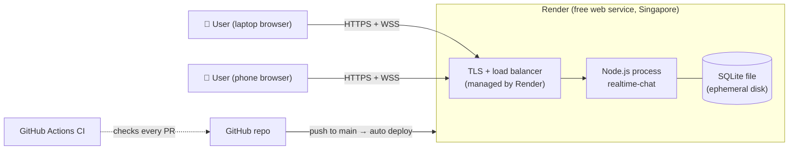
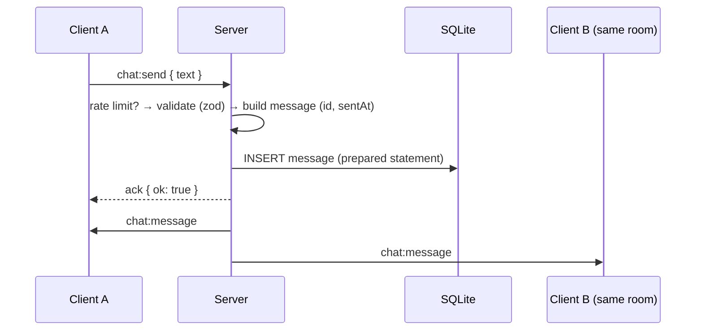

# High-Level Design (HLD)

The **big picture**: components, how they talk, where they run, and the main trade-offs.

## System context



## Components

| Component | Responsibility | Tech |
|---|---|---|
| **Static frontend** | Layout, themes, rendering, slash commands | HTML, CSS variables, vanilla JS |
| **HTTP layer** | Serve `public/`, `/health`, security headers | Express |
| **Realtime layer** | Connections, rooms, broadcasting, reconnection | Socket.IO |
| **Validation** | Reject malformed or oversized input | zod |
| **Rate limiter** | Slow down spam per socket / IP | In-memory token bucket |
| **Presence** | Who is in which room, who is typing | In-memory maps |
| **Persistence** | Store and load message history | better-sqlite3 |
| **Hosting** | TLS, build, run, health checks, auto-deploy | Render |

## Main request flows

**1. Page load:** browser → `GET /` over HTTPS → Express serves `index.html`, `styles.css`, `client.js`.

**2. Connect:** `client.js` calls `io()` → HTTP handshake → upgrade to WebSocket (`wss://`) → server checks Origin and the IP connection count.

**3. Send message:**



## Key design decisions (see [`adr/`](adr/))

| Decision | Choice | Main reason |
|---|---|---|
| Realtime transport | Socket.IO | Rooms, reconnection, acks built in → ADR-0001 |
| Storage | SQLite (better-sqlite3) | Zero setup, fast, enough for one instance → ADR-0002 |
| Hosting | Render free tier | Free, supports WebSockets, auto-deploy from GitHub → ADR-0003 |
| Frontend | Plain HTML/CSS/JS | No build step, small, teaches fundamentals → ADR-0004 |

## Quality attributes and trade-offs

| Attribute | Current approach | Trade-off we accept |
|---|---|---|
| **Scalability** | Single instance, in-memory state | Can't run 2+ instances without a Redis adapter. Fine for v1 traffic |
| **Reliability** | Client auto-reconnect, health checks, graceful shutdown | 15-min idle sleep → ~1 min cold start |
| **Durability** | SQLite on local disk | Free-tier disk is wiped on restart → history is best-effort |
| **Security** | Validate + rate limit + safe rendering + headers | No accounts → names can be impersonated (accepted, documented) |
| **Cost** | $0 | Free-tier limits (750 h/month, 5 GB bandwidth) |

## How this would look at large scale (for learning)

```
Clients → CDN (static files) → Load balancer (sticky sessions)
        → N × Node/Socket.IO instances ←→ Redis (pub/sub adapter + rate limits + presence)
        → Postgres (messages, partitioned by room/time) + object storage (files)
        → Metrics (Prometheus/Grafana), logs (ELK/Datadog), tracing (OpenTelemetry)
```
We deliberately **don't** build this now. Our traffic doesn't need it, and every box adds cost and failure modes.
