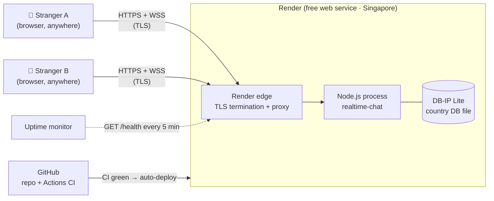
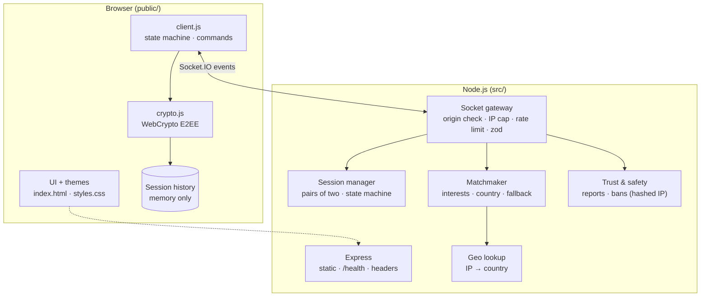
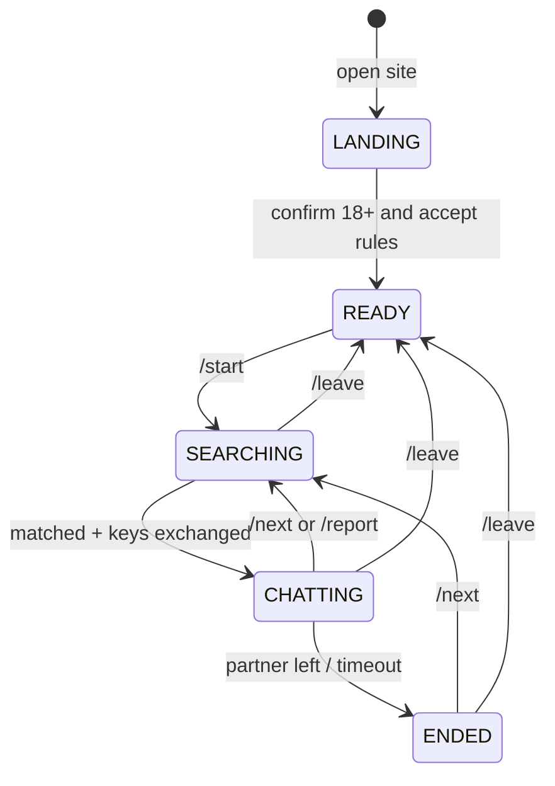
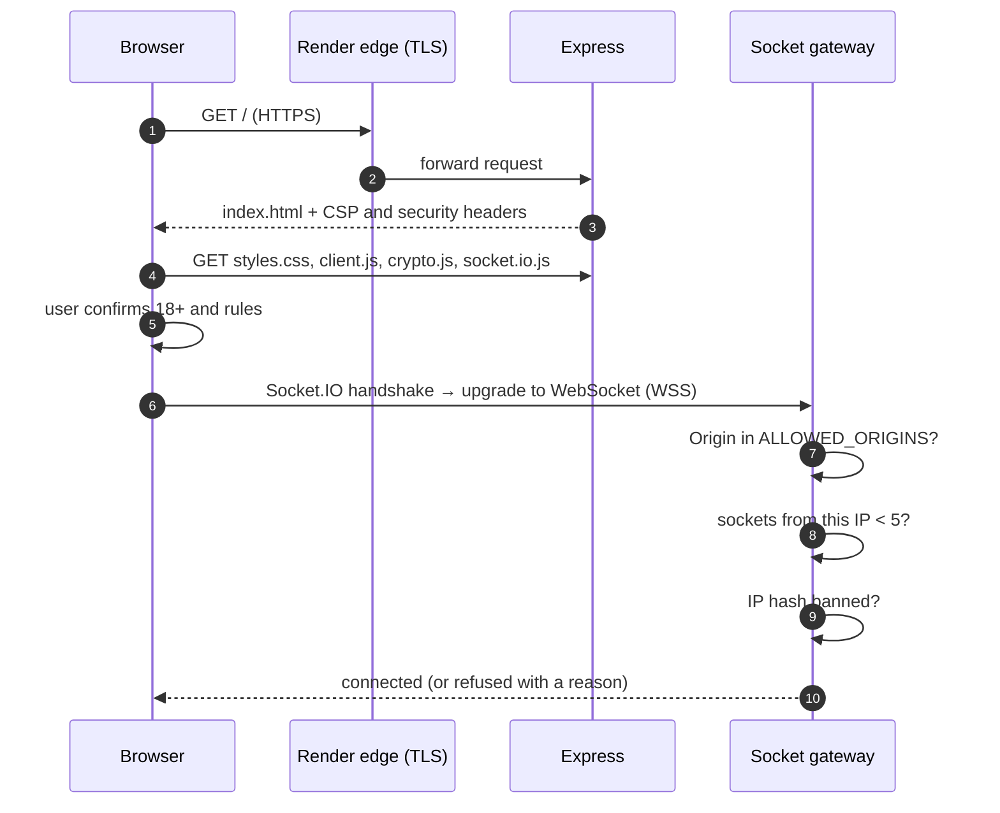
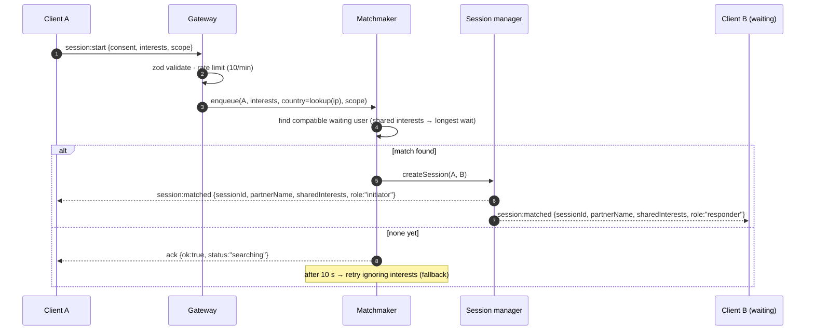
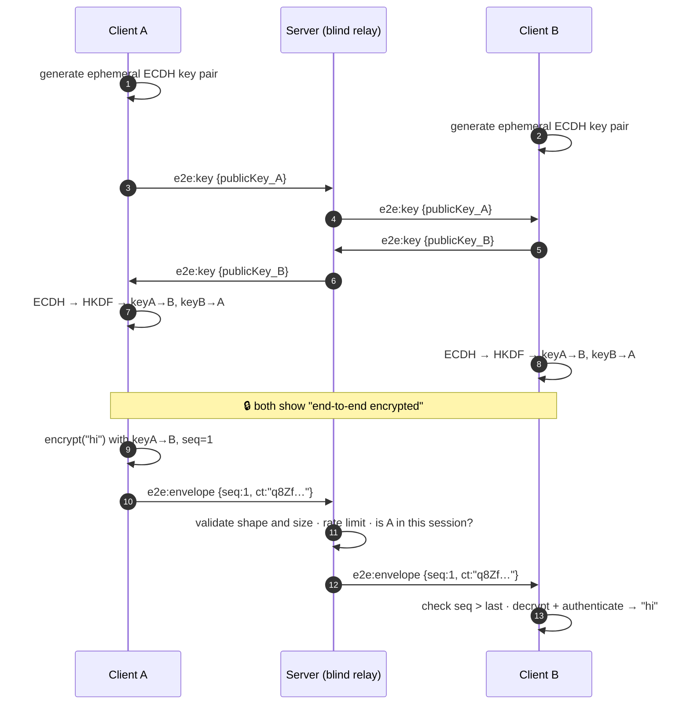
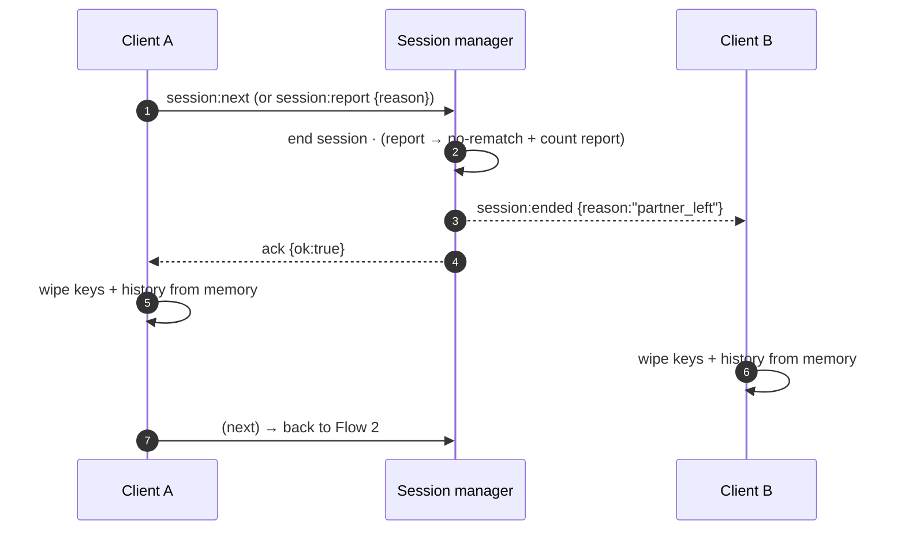
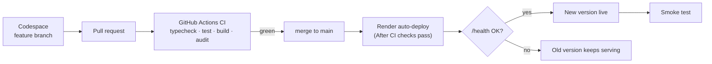

# High-Level Design (HLD)

The **big picture**: what the parts are, where they run, and how a request travels through the system.

## 1. System context

**Key idea: the server is a blind relay.** Messages are encrypted in A's browser and decrypted in B's browser. The server matches people and forwards scrambled bytes, and it stores nothing.

## 2. Components

| Component | Responsibility | Tech |
|---|---|---|
| UI / client.js | Rendering, commands, client state, session history in memory | Vanilla JS |
| crypto.js | Key generation, key exchange, encrypt/decrypt, safety code | WebCrypto |
| Express | Static files, `/health`, security headers | Express + helmet |
| Socket gateway | First line of defense: Origin, per-IP caps, rate limits, schema validation | Socket.IO + zod |
| Session manager | Creates and ends 2-person sessions; relays envelopes to the partner only | In-memory maps |
| Matchmaker | Waiting pool; interest/country matching; 10 s fallback | In-memory indexes |
| Trust & safety | Reports, no-rematch, temporary bans by daily-salted IP hash | In-memory, TTL |
| Geo lookup | IP → country code, then the IP is discarded | DB-IP Lite (MMDB) |

## 3. User lifecycle

## 4. Request flows, step by step

### Flow 1: Page load and connection

1–3. The page and its security headers arrive over HTTPS; the CSP tells the browser to run only our scripts.
4. Static files, served by our own server with no third-party CDNs.
5. The consent gate is on the client and is enforced again on the server in step 1 of Flow 2.
6–10. The gateway checks *who may connect* before any chat logic runs. It's cheap and it rejects abuse early.

### Flow 2: Matchmaking

- The country is looked up from the IP **on the server**; the IP isn't stored.
- Names are generated by the server when the session is created (FR-01).

### Flow 3: Key exchange and encrypted messaging

- The server sees **public keys** (safe to share) and **ciphertext**. It never sees the shared secret or plaintext.
- Details and limits: [04-security/e2ee.md](../04-security/e2ee.md).

### Flow 4: Skip, report or disconnect

A sudden disconnect follows the same path after the **30 s** recovery window.

## 5. Deployment pipeline

Details: [07-process/ci-cd.md](../07-process/ci-cd.md), [06-operations/deployment.md](../06-operations/deployment.md).

## 6. Key decisions ([ADRs](adr/README.md))
| Decision | Choice | ADR |
|---|---|---|
| Real-time transport | Socket.IO (server relay, **not** peer-to-peer WebRTC) | 0001, 0008 |
| Storage | **No message storage**; in-memory only | 0005 (supersedes 0002) |
| Identity | No accounts, no JWT; random names per session | 0006 |
| Encryption | E2EE with WebCrypto ECDH P-256 + AES-GCM | 0007 |
| Hosting | Render free tier; deploy early and continuously | 0003, 0010 |
| Country detection | Server-side IP lookup with DB-IP Lite | 0009 |
| Frontend | Plain HTML/CSS/JS | 0004 |

## 7. Quality attributes and trade-offs
| Attribute | Approach | Trade-off we accept |
|---|---|---|
| **Privacy** | E2EE, no storage, no raw IPs | Can't moderate content → rely on reports |
| **Security** | Validate + rate limit + CSP + Origin | Some friction for legit power users |
| **Scalability** | Single instance; interfaces ready for Redis | Free tier = one instance (see [scaling.md](../06-operations/scaling.md)) |
| **Reliability** | Health checks, graceful shutdown, 30 s recovery | 15-min idle sleep → ~1 min cold start |
| **Latency (global)** | One region (Singapore) | Users in the Americas/Europe see ~150–300 ms extra round-trip time |
| **Cost** | $0 | Free-tier quotas (750 h, 5 GB bandwidth/month) |
