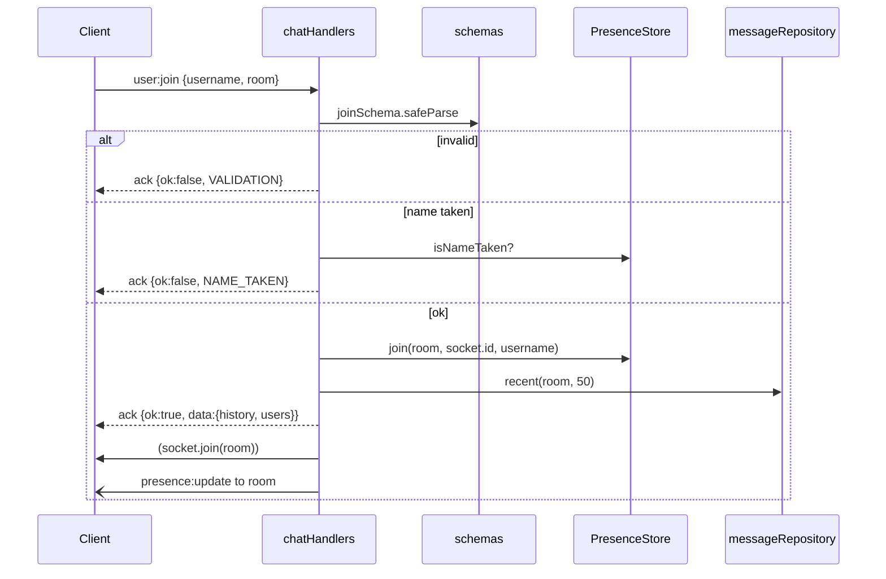

# Low-Level Design (LLD)

The **detail**: modules, types, event contracts, schemas, algorithms and DB schema.
Items marked 🔜 are the design we will implement; the code is the source of truth once merged.

## 1. Module layout (target)

```
src/
├── index.ts                 ✅ entry: load config, listen, shutdown
├── app.ts                   ✅ buildServer(config): wires Express + Socket.IO (no listen)
├── types.ts                 ✅ shared event + payload types
├── config.ts                🔜 reads env → validated Config object (zod)
├── validation/
│   └── schemas.ts           🔜 zod schemas for every client→server event
├── security/
│   ├── rateLimiter.ts       🔜 TokenBucket class (pure, injectable clock)
│   └── originCheck.ts       🔜 allowRequest(origin) for Socket.IO
├── presence/
│   └── presenceStore.ts     🔜 rooms ↔ users, typing state
├── db/
│   ├── database.ts          🔜 opens SQLite, runs migrations
│   └── messageRepository.ts 🔜 insert(), recent(room, limit)
├── handlers/
│   └── chatHandlers.ts      🔜 registers socket events, glues everything together
└── logger.ts                🔜 JSON logger
```

**Dependency rule:** `handlers` → (`validation`, `security`, `presence`, `db`). The lower modules never import `handlers` or `socket.io`, so they are pure and easy to unit test.

## 2. Event contracts

### Client → Server
| Event | Payload | Ack |
|---|---|---|
| `user:join` 🔜 | `{ username: string, room: string }` | `Ack<{ history: ChatMessage[], users: string[] }>` |
| `chat:send` ✅→🔜 | `{ text: string }` (currently a bare string) | `Ack` |
| `typing:start` 🔜 | none | — |
| `typing:stop` 🔜 | none | — |

### Server → Client
| Event | Payload |
|---|---|
| `chat:message` ✅ | `ChatMessage` |
| `presence:update` 🔜 | `{ room: string, users: string[] }` |
| `typing:update` 🔜 | `{ username: string, isTyping: boolean }` |

### Shared types
```ts
interface ChatMessage {
  id: string;        // crypto.randomUUID()
  room: string;      // 🔜
  from: string;      // username (currently socket id prefix)
  text: string;
  sentAt: number;    // Date.now(), server clock, UTC epoch ms
}

type Ack<T = undefined> =
  | ({ ok: true } & (T extends undefined ? {} : { data: T }))
  | { ok: false; error: { code: ErrorCode; message: string } };

type ErrorCode = "VALIDATION" | "RATE_LIMITED" | "NAME_TAKEN" | "NOT_JOINED" | "INTERNAL";
```
**Why acks:** the client learns *why* something failed (e.g. "name taken") instead of guessing.

## 3. Validation schemas (zod) 🔜

```ts
export const usernameSchema = z.string().trim().min(2).max(20).regex(/^[A-Za-z0-9_-]+$/);
export const roomSchema     = z.string().trim().toLowerCase().min(1).max(30).regex(/^[a-z0-9-]+$/);
export const joinSchema     = z.object({ username: usernameSchema, room: roomSchema }).strict();
export const sendSchema     = z.object({ text: z.string().trim().min(1).max(500) }).strict();
```
`.strict()` rejects unknown extra fields, so clients can't sneak in data.

## 4. Rate limiter: token bucket 🔜

```
capacity = 5 tokens, refill = 0.5 tokens/second
on each message:
  tokens = min(capacity, tokens + elapsedSeconds * refillRate)
  if tokens >= 1 → tokens -= 1, ALLOW
  else           → REJECT ("RATE_LIMITED"); strikes++ ; if strikes >= 10 → disconnect
```
- **Why a token bucket:** it allows short natural bursts ("hi" "how are you" "?") but caps the sustained rate. A fixed window ("5 per 10 s") allows 10 messages in 1 s across the window boundary.
- **Complexity:** O(1) time, O(1) memory per socket. The bucket is deleted on disconnect, so there's no memory leak.
- **Testability:** the constructor takes `now: () => number`, so tests control time.
- **Per-IP connections:** `Map<ip, count>`, max 5. On Render, the client IP comes from `X-Forwarded-For` (first hop, set by Render's proxy).

## 5. Presence store 🔜

```ts
class PresenceStore {
  private rooms = new Map<string, Map<string /*socketId*/, string /*username*/>>();
  join(room, socketId, username): void   // O(1)
  leave(socketId): string | undefined    // returns room left; O(1) with reverse index
  users(room): string[]                  // O(n) users in room
  isNameTaken(room, username): boolean   // case-insensitive
}
```
A reverse index `Map<socketId, room>` makes `leave` O(1) instead of scanning every room.

## 6. Database 🔜

```sql
CREATE TABLE IF NOT EXISTS messages (
  id        TEXT    PRIMARY KEY,
  room      TEXT    NOT NULL,
  username  TEXT    NOT NULL,
  text      TEXT    NOT NULL,
  sent_at   INTEGER NOT NULL          -- epoch ms, UTC
);
CREATE INDEX IF NOT EXISTS idx_messages_room_sent_at ON messages (room, sent_at DESC);
```
- **Recent history:** `SELECT ... WHERE room = ? ORDER BY sent_at DESC LIMIT 50`, then reverse in code. The index makes this O(log n + 50) instead of a full table scan.
- **Prepared statements only** (`db.prepare(...)`), so SQL injection is impossible through parameters.
- `PRAGMA journal_mode = WAL` for better concurrent reads.
- **Retention:** keep the last 500 messages per room (cleanup on insert every N messages) so the file can't grow without limit.

## 7. Sequence: join a room 🔜



## 8. Error handling rules
- Every handler is wrapped: `try { ... } catch { log; ack INTERNAL }`. One bad event must never crash the process.
- Never send stack traces or internal messages to clients.
- `process.on("unhandledRejection")` → log + exit(1). Render restarts the process (fail fast instead of staying half-broken).

## 9. Frontend structure ✅
`client.js` is organized as Config → DOM refs → State → Rendering → Themes → Socket events → Commands → Input → Boot.
Rendering always uses `document.createElement` + `textContent`.
