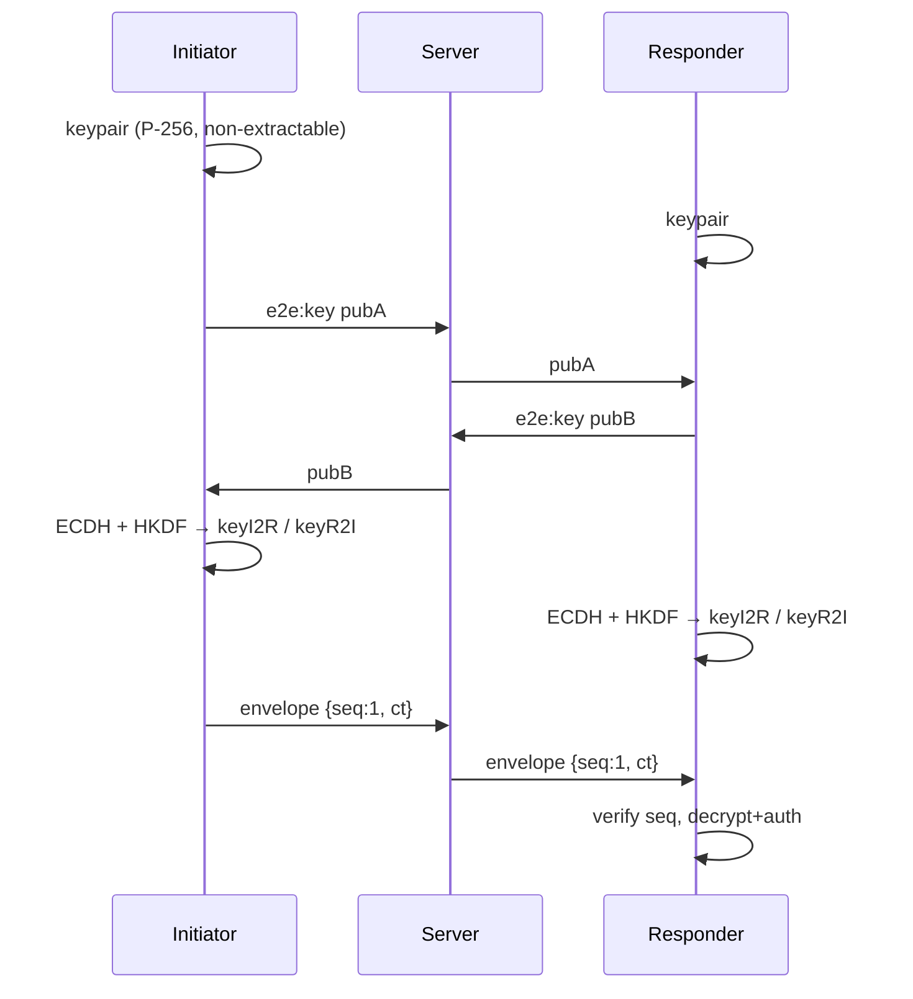

# End-to-End Encryption (E2EE)

> **Promise:** only the two people in a chat can read their messages. Not other users, not the hosting provider, **not us**.
> **Honest limit:** in a web app the server also delivers the code that does the encrypting. Section 7 explains what that means.

## 1. TLS vs. E2EE
| | TLS (HTTPS/WSS) | E2EE (this doc) |
|---|---|---|
| Encrypts between | Browser ↔ server | Browser ↔ browser |
| Server can read messages? | **Yes** (it decrypts TLS) | **No** (only ciphertext) |
| Protects against | Wi-Fi snoopers, ISPs | All of those **plus** server logs, hosting provider, breaches, curious operators |

We use **both**: TLS protects metadata and public keys in transit; E2EE protects content from the server itself.

## 2. Goals and non-goals
| ✅ E2EE protects against | ❌ E2EE does NOT protect against |
|---|---|
| The server, its logs, Render, or a database breach reading messages (there is no database) | The **stranger** saving, screenshotting or sharing what you wrote |
| A passive attacker who later steals server memory dumps or logs | Malware on a user's device |
| Tampering with, replaying or reordering messages in transit | An operator who ships **malicious JavaScript** (§7) |
| Decrypting **past** sessions after a later compromise (forward secrecy per session) | Metadata: *that* two connections chatted, when, and roughly how much (§6) |

## 3. Building blocks (all native WebCrypto, `crypto.subtle`)
| Primitive | Used for | Why this one |
|---|---|---|
| **ECDH P-256** | Agree on a shared secret over the untrusted server | Supported by every modern browser; X25519 only in Chrome since v133 (2025) |
| **HKDF-SHA-256** | Turn the shared secret into proper keys | The raw ECDH output isn't uniformly random; HKDF fixes that and lets us derive several independent keys |
| **AES-GCM-256** | Encrypt + authenticate each message | Fast (hardware-accelerated), and detects any change to the ciphertext |
| **SHA-256** | Safety code, HKDF salt | Standard hash |
| `crypto.getRandomValues` (inside WebCrypto) | Key generation | Cryptographically secure randomness. **Never** `Math.random()` |

**Rule: we implement no cryptographic primitive ourselves.** We only combine standard ones in a documented way.

## 4. The protocol, step by step

### Step 0: Match
The server sends both clients `session:matched {sessionId, role}`. One is the `initiator` and the other the `responder`, which fixes the order of keys in the formulas below.

### Step 1: Generate ephemeral key pairs (each client)
```js
const kp = await crypto.subtle.generateKey(
  { name: "ECDH", namedCurve: "P-256" },
  false,                       // private key NOT extractable: JS can use it but never read its bytes
  ["deriveBits"]
);
const pubRaw = new Uint8Array(await crypto.subtle.exportKey("raw", kp.publicKey)); // 65 bytes
```
A fresh pair is made **for every session** and never saved anywhere.

### Step 2: Exchange public keys through the server
`e2e:key { publicKey: base64url(pubRaw) }`. The server checks the format (87 chars) and that each side sends exactly **one** key per session, then relays it. Public keys are safe to share; that's the point of public-key crypto.

### Step 3: Validate the peer's key
```js
const peer = await crypto.subtle.importKey("raw", peerRaw, { name: "ECDH", namedCurve: "P-256" }, false, []);
```
- `importKey` rejects points that aren't on the curve (invalid-curve attacks).
- Reject if `peerRaw` equals our own key (reflection attack).

### Step 4: Shared secret → two keys
```js
const shared = await crypto.subtle.deriveBits({ name: "ECDH", public: peer }, kp.privateKey, 256);
const ikm  = await crypto.subtle.importKey("raw", shared, "HKDF", false, ["deriveKey"]);
const salt = sha256(utf8("rc/v1/salt|" + sessionId));
const th   = sha256(concat(initiatorPub, responderPub));       // binds keys to THIS exchange

keyI2R = deriveKey(HKDF{ hash:"SHA-256", salt, info: utf8("rc/v1 i2r|") ‖ th }) → AES-GCM-256
keyR2I = deriveKey(HKDF{ hash:"SHA-256", salt, info: utf8("rc/v1 r2i|") ‖ th }) → AES-GCM-256
```
The initiator **sends** with `keyI2R` and **receives** with `keyR2I`; the responder does the opposite. Both keys are non-extractable.

**Why two keys?** Both sides count messages from 1. With a single shared key, both would encrypt "message #1" with the same IV, and **reusing an IV with the same AES-GCM key is catastrophic**: it leaks the XOR of the plaintexts and allows forgeries. Separate keys per direction make collisions impossible.

### Step 5: Encrypt a message
```
plain = JSON { t:"msg", text } or { t:"react", ref, emoji }
plain = pad(plain) to a multiple of 64 bytes            // hides exact length
iv    = 4 zero bytes ‖ seq as 8-byte big-endian         // 12 bytes, unique per key
aad   = utf8("rc/v1|" + sessionId + "|" + direction + "|" + seq)
ct    = AES-GCM-256(key, iv, aad, plain)                 // includes a 16-byte auth tag
send  e2e:envelope { seq, ct: base64url(ct) }
```
- `seq` starts at 1 and increases by 1 per envelope. It **never** repeats in a session.
- AAD isn't secret but is authenticated: moving a ciphertext to another session, direction or position makes decryption fail.

### Step 6: Decrypt
1. `seq` must be **greater** than the last accepted `seq` → otherwise reject (replay/reorder).
2. Rebuild `iv` and `aad` from `seq`; `AES-GCM decrypt`. Any modification → it throws.
3. Remove padding; validate the JSON shape (`t`, lengths, allowed emoji).
4. 3 failures in a session → show `!!! secure channel error` and end the session.

### Step 7: Safety code (optional verification)
```
code = SHA-256( utf8("rc/v1/safety|" + sessionId) ‖ initiatorPub ‖ responderPub )
first 20 bytes → four 5-byte chunks → each (big-endian int mod 100000), zero-padded
→ "48213 99307 17742 03621"
```
If the server swapped keys (MITM), each side computes the code over **different** public keys, so the codes won't match.
⚠️ **Compare it over a different channel** (a voice call, another app). If you compare it inside this chat, a MITM can rewrite the message containing the code.

### Step 8: End of session
Drop every reference to keys, counters and history; the UI clears. CryptoKeys were never extractable. (JavaScript can't force memory to be wiped immediately, but nothing references the keys any more.)

## 5. Sequence overview


## 6. What the server still sees (metadata)
| Visible to the server | Hidden from the server |
|---|---|
| That socket X and socket Y were paired, and when | Message text, reactions |
| Number and **size bucket** of envelopes (padded to 64 bytes), timing | Exact message length |
| Public keys (useless without private keys) | Shared secret, AES keys |
| Typing on/off signals (plaintext, D-08) | |
| IP (transiently), country code, interests (needed for matching) | |

## 7. The web E2EE caveat: "who delivers the code?"
Every time the page loads, **our server sends `crypto.js`**. A malicious or compromised server could send a modified version that leaks keys. No web-only E2EE fully solves this (it's a known limitation of browser-based E2EE in general).

**Mitigations:**
- Strict **CSP**: only our own scripts run; no inline scripts except the hashed theme script; no third-party CDNs
- The Socket.IO client is served from our own server (no external CDN)
- **Open source**: anyone can read `crypto.js`; releases publish SHA-256 hashes of `public/js/*`
- Deploys only through reviewed PRs + green CI (no manual uploads)
- **XSS = total E2EE failure** (an injected script can use the keys), so the `textContent`-only rule and CSP are security-critical

**Accepted residual risk (T-09):** users must trust that the operators deploy honest code. We say this plainly in the privacy notice.

## 8. Requirements & gotchas
- `crypto.subtle` exists only in **secure contexts**: HTTPS, or `http://localhost`. Opening the dev server from a phone via `http://192.168.x.x` **won't work**: use the Codespaces HTTPS URL or the Render URL.
- **No fallback:** if WebCrypto is missing or key exchange fails, the session ends. It never sends plaintext.
- Never log keys, plaintext or decrypted objects, not even in development.

## 9. Test plan
| Test | Type |
|---|---|
| Round trip: encrypt → decrypt returns the same object | Unit (Node has WebCrypto: `globalThis.crypto.subtle`) |
| Flip 1 bit of `ct` → decrypt throws | Unit |
| Same `ct` delivered twice → second rejected (seq) | Unit |
| Envelope from session X replayed into session Y → fails (AAD) | Unit |
| Both directions start at seq 1 → no IV collision (different keys) | Unit |
| Invalid / own public key → rejected | Unit |
| Both sides compute identical safety codes; MITM simulation → codes differ | Unit |
| Server-side spy: no plaintext ever passes through the server | Integration |

## 10. Future improvements
X25519 once supported everywhere · re-key every N messages (stronger forward secrecy within long sessions) · reproducible builds + published hashes checked by a browser extension.
