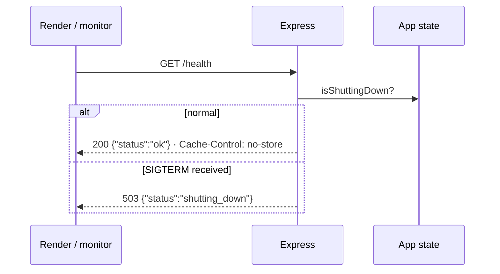

# Health Checks (`/health`)

## Definition
A **health check** is a tiny HTTP endpoint that answers one question for machines: *"Is this server alive and able to serve traffic?"*

```
GET /health  →  200 {"status":"ok"}          (alive and accepting traffic)
             →  503 {"status":"shutting_down"} (alive but draining: don't send new users)
```

## Purpose: who calls it and why
| Caller | Why | What happens on failure |
|---|---|---|
| **Render** (on every deploy) | Is the new version working? | Deploy aborted; the old version keeps serving |
| **Render** (continuously) | Has the running server hung? | Instance restarted |
| **Uptime monitor** (M7) | Is the site reachable from the internet? | Email alert to us |
| **CI/CD smoke test** (M7) | Did the deploy actually go live? | Pipeline marked failed |
| Humans | Quick manual check | — |

## How it works internally

- It **doesn't** touch the matchmaker, sessions or any user data: it must be fast (< 5 ms) and must never fail because of user load.
- **Graceful shutdown:** when Render sends `SIGTERM` (deploy/restart), we flip `isShuttingDown = true`, so `/health` returns 503 and new connections are refused; existing sessions get `session:ended`; the process exits within 10 s.

## Liveness vs. readiness (interview-level)
| Concept | Question | Our endpoint |
|---|---|---|
| **Liveness** | "Is the process alive, or should it be restarted?" | `/health` = 200 |
| **Readiness** | "Should traffic be sent here right now?" | `/health` = 503 while draining |
Kubernetes usually splits these into `/livez` and `/readyz`. On one Render instance, one endpoint covering both is enough.

## Rules
- ✅ Public, no auth, `Cache-Control: no-store`, exempt from rate limits, minimal JSON
- ❌ Never include version numbers, dependency lists, user counts, IPs or errors (attackers love detailed health pages)
- ❌ Never do slow work (DB calls, external APIs) inside it

## Common mistakes
- Returning 200 even while shutting down → users get routed to a dying server
- Health checks that call external services → your app restarts whenever *their* service hiccups
- Caching the response → monitors see stale "ok"
