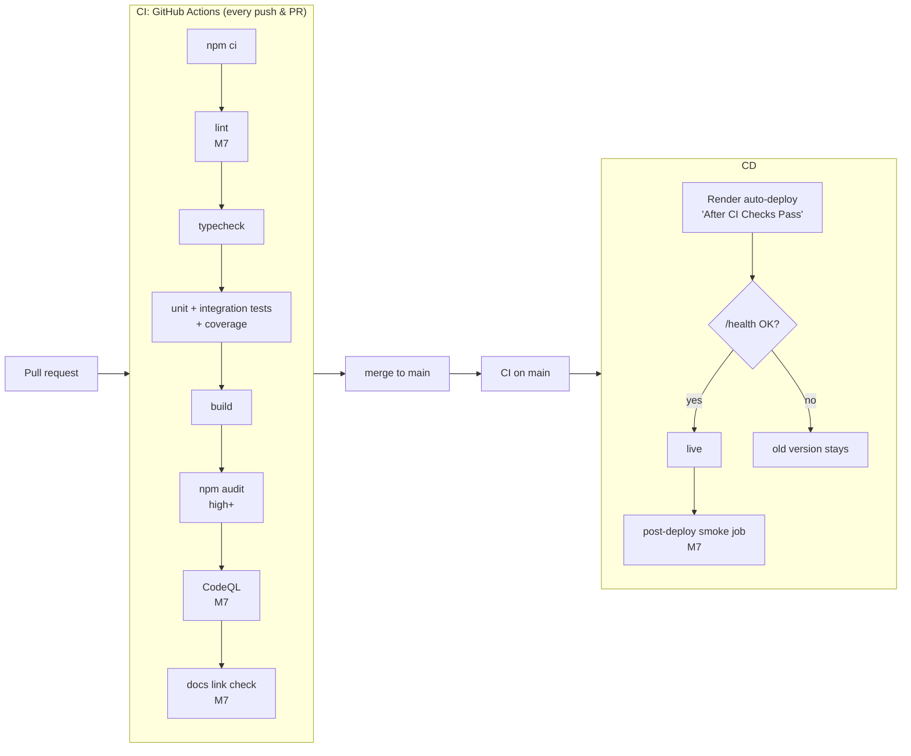

# CI/CD Pipeline

**Yes, we have a plan for a fully automated CI/CD pipeline.** It's built in M2 and extended in M7.

## Definitions
- **CI (Continuous Integration):** every push/PR is automatically installed, checked, tested and built. Broken code is caught **before** merging.
- **CD (Continuous Deployment):** every change merged to `main` that passes CI is deployed to production **automatically**, with no manual steps.

## Target pipeline


## Rollout plan
| Step | Milestone |
|---|---|
| `ci.yml`: install → typecheck → test → build → audit | **M2** |
| Branch protection: PR required, CI must pass, no force-push to `main` | **M2** |
| Render Auto-Deploy = **After CI Checks Pass** | **M2** |
| ESLint + Prettier check, coverage report, CodeQL, link checker | M7 |
| Post-deploy smoke job (calls the live `/health` and the page) | M7 |
| Monthly job: refresh the DB-IP country database via PR | M7 |

## Planned workflow file (`.github/workflows/ci.yml`, M2)
```yaml
name: CI
on:
  push:
    branches: [main]
  pull_request:

permissions:
  contents: read          # least privilege

concurrency:              # cancel outdated runs on the same branch
  group: ci-${{ github.ref }}
  cancel-in-progress: true

jobs:
  build-and-test:
    runs-on: ubuntu-latest
    timeout-minutes: 10
    steps:
      - uses: actions/checkout@v4
      - uses: actions/setup-node@v4
        with:
          node-version-file: .node-version
          cache: npm
      - run: npm ci
      - run: npm run typecheck
      - run: npm test
      - run: npm run build
      - run: npm audit --audit-level=high
```

## Why each piece exists
| Piece | Protects against |
|---|---|
| `npm ci` | "Works on my machine": installs exact lockfile versions |
| typecheck | Type errors reaching production |
| tests | Regressions in security, crypto and matching logic |
| build | A deploy failing on Render after merge |
| `npm audit` | Known-vulnerable dependencies (T-21) |
| `permissions: contents: read` | A compromised action can't push code |
| branch protection | Anyone (including you at 2 a.m.) merging red code |
| "After CI Checks Pass" | Red builds never reach users |

## Cost
GitHub Actions minutes are free for **public** repositories, and private repos get a monthly free allowance. Render deploys are included in the free plan. **Total: $0.**
