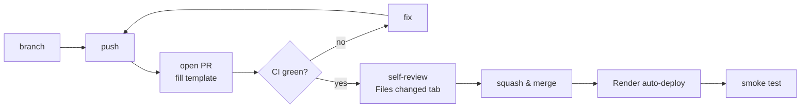

# Workflows

## 1. Branching
- `main` is always deployable (it **is** production).
- One branch per change: `type/short-description`, for example `feat/rate-limiter`, `fix/typing-timeout`, `docs/threat-model`.
- Branch from an up-to-date `main`: `git checkout main && git pull && git checkout -b feat/...`

## 2. Commits: Conventional Commits
`type(scope): summary` in the imperative mood, ≤ 72 chars.
Types: `feat` · `fix` · `docs` · `test` · `refactor` · `chore` · `ci` · `perf` · `style`
Example: `feat(security): add token-bucket rate limiter`

## 3. Development loop
```
pick a story → branch → write/adjust tests → code → npm run typecheck && npm test
→ manual check (2 tabs) → update docs → commit → push → PR
```

## 4. Pull request flow


## 5. Definition of Ready (before starting a story)
- [ ] Story has acceptance criteria
- [ ] Design is clear (LLD updated if new events/modules)
- [ ] Security impact considered (new input? → schema + threat model row)

## 6. Definition of Done
- [ ] Acceptance criteria met
- [ ] Tests added/updated; `npm test` green
- [ ] `npm run typecheck` and `npm run build` pass
- [ ] Docs updated (features status, specs, LLD, README roadmap)
- [ ] PR merged; deploy smoke-tested

## 7. Hotfix
Production broken → roll back in Render first (restore service), **then** `fix/...` branch → PR → merge.

## 8. Documentation workflow
- New feature → row in `features.md` + story in `user-stories.md`
- New decision → new ADR from the template
- New input/endpoint → new row in `threat-model.md`
- End of milestone → tick `milestones.md` and the README roadmap
