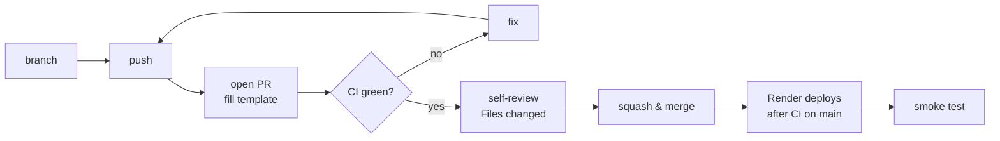

# Workflows

## 1. Branching
- `main` is always deployable; it **is** production (auto-deployed after CI).
- One branch per change: `type/short-description` → `feat/token-bucket`, `fix/typing-timeout`, `docs/e2ee`.
- Always branch from an up-to-date `main`: `git checkout main && git pull && git checkout -b feat/...`
- Run `git status` before switching branches (uncommitted changes travel with you).

## 2. Commits: Conventional Commits
`type(scope): summary` (imperative, ≤ 72 chars). Types: `feat fix docs test refactor chore ci perf style`.
Example: `feat(crypto): derive per-direction AES-GCM keys with HKDF`

## 3. Development loop
```
pick a story (milestones.md) → branch → write/adjust tests → code → npm run typecheck && npm test
→ manual check (2–3 tabs) → update docs → commit → push → PR → CI green → merge → auto-deploy → smoke test
```

## 4. Pull request flow


## 5. Definition of Ready (before starting a story)
- [ ] Story has acceptance criteria and linked features
- [ ] Design is clear (LLD/ADR updated if new events/modules/decisions)
- [ ] Security & privacy impact considered (new input → schema; new risk → threat row; new data → data inventory)

## 6. Definition of Done: three levels
| Level | Where it's defined | Summary |
|---|---|---|
| **Story** | [user-stories.md](../01-product/user-stories.md#definition-of-done-for-every-story) | AC pass · tests · schemas/threats · CI green · no plaintext on server · mobile + keyboard · docs · deployed |
| **Milestone** | [milestones.md](../01-product/milestones.md#milestone-definition-of-done-applies-to-every-milestone) | All stories Done · exit criteria · demo on live URL · security docs updated · retro note |
| **Release (v1)** | [milestones.md → M8](../01-product/milestones.md#m8-public-launch-) | Security checklist 100% · decisions resolved · privacy notice · tag `v1.0.0` |

## 7. Hotfix
Production broken → **roll back in Render first** (restore service) → `fix/...` branch with a failing test → PR → merge.

## 8. Documentation workflow
| Change | Update |
|---|---|
| New/changed feature | `features.md` status, story AC, `specs.md` |
| New event or module | `low-level-design.md`, `validation-zod.md`, threat-model row |
| New data collected | privacy data inventory |
| New decision | new ADR |
| Milestone finished | `milestones.md` checkboxes + retro, README status table |
